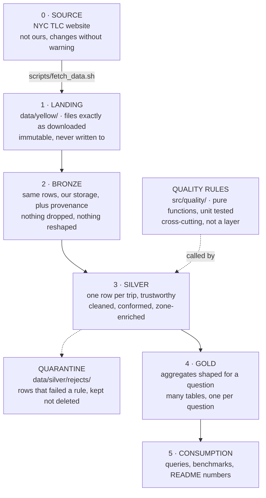

# Project plan

> The map. Read this before starting any layer, and go deeper in that layer's own
> notebook when you get to it.

---

## 1. What this is

A batch pipeline that turns monthly NYC yellow taxi files into tables an analyst
can query, plus a benchmark suite that measures the cost of the decisions made
along the way.

**The questions the finished product answers:**

- Which pickup zones generate the most revenue, and when?
- How does demand vary by hour of day and day of week?
- How do the five boroughs compare on trip volume, fare and tip?
- How much of the source data is unusable, and is that fraction stable month to month?

**Who it is for:** someone who wants to query tables, not read pipeline code. That
distinction decides what gold looks like.

**What makes this a portfolio piece rather than a tutorial:**

1. It is re-runnable, and re-running it does not corrupt anything.
2. It survives new months arriving without a code change.
3. Every performance decision in it has a measured number behind it.

Points 1 and 2 are where most tutorial pipelines fail. Point 3 is what an
interviewer actually asks about.

---

## 2. The shape

---

## 3. How data arrives

This is the part that makes it a pipeline rather than a script.

A real batch pipeline runs on a schedule against a location where new files
appear. It has to answer one question every run: **what is here that I have not
already processed?**

### The model

`data/yellow/` is the landing area. `fetch_data.sh` drops files into it. The
pipeline reads what is there and processes what is new.

To simulate the second run, fetch more months into the same folder and run the
pipeline again. Nothing else changes. That is exactly what happens in production
when the next day's file lands.

### ⚠️ Two folders is the wrong shape

An `incoming/` folder that gets emptied looks intuitive but it fights the landing
rule: landing is immutable, and moving files out of it means you can no longer
rebuild from source. It also hides the real problem instead of solving it.

**The real solution is a processed manifest**: a small record of which source
files have already been loaded, checked at the start of every run. Files stay
where they are. The pipeline knows what it has seen.

### But not yet

Build the naive version first: glob everything, process everything, append. Then
add months 4 to 12, run it again, and watch every existing row duplicate. Fixing
that with a manifest, and later with Iceberg MERGE, is planted mistake number one
and the most valuable one in the project.

### Orchestration, at the end

Once the pipeline runs correctly, wrap it in an Airflow DAG: one task per layer,
bronze to silver to gold, with dependencies. Worth doing because Airflow is
already on the CV from Dentsu work, and a public repo that shows it is worth more
than a line claiming it. Not before the pipeline is correct.

---

## 4. The layers

### Layer 0 · Source

Monthly Parquet from the NYC TLC, plus `taxi_zone_lookup.csv` (265 zones, 12 KB).

**We do not control it.** Columns get added between years, types change, files get
silently republished. Every design decision downstream assumes the source will
surprise us.

### Layer 1 · Landing

`data/yellow/`, already built by `scripts/fetch_data.sh`.

**The rule: never write here, never modify anything in it.** It exists so that
when something downstream is wrong, we can rebuild and prove what the source
actually said.

### Layer 2 · Bronze

**Answers: what did the source say, and when did we hear it?**

**The rule: do not reshape anything.** Same rows, same columns, same types.

| Belongs in bronze | Does not, and goes to |
|---|---|
| Every row including bad ones | filtering impossible values → **silver** |
| Original column names and types | renaming, casting, timezone → **silver** |
| Which file each row came from | derived business columns → **silver** |
| When it was loaded | the zone lookup join → **silver** |
| A check that the schema is as expected | any aggregation → **gold** |

**Why cleaning must not happen here.** Drop a row in bronze and the evidence is
gone. When someone asks why January revenue moved, the answer is in the rows you
deleted.

**Why provenance columns are not "reshaping".** They describe the load, not the
trip. They are the difference between "the numbers look wrong" and "the numbers
look wrong for rows loaded on the 14th from file X".

**Decisions this layer forces:**

1. How do we know what has already been loaded?
2. How is it laid out on disk?
3. What happens when the source schema changes: fail, or accept and record?
4. One table for everything, or one per month?

### Layer 3 · Silver

**Answers: what is true?**

**The rule: still one row per trip.** No aggregation anywhere in this layer.

**Clean.** Reject rows that cannot be real. This data has all of them: negative
fares, zero-distance trips with a fare, dropoff before pickup, and pickup
timestamps outside the file's own month including trips dated 2002 and 2009.

**Conform.** One set of types, one timezone, one naming convention. Whatever the
source called something, silver calls it one thing forever.

**Enrich.** Join the zone lookup so `PULocationID = 132` becomes
`JFK Airport, Queens`.

**Why the join is here and not in gold:** every gold table would otherwise repeat
it. Enrichment that is universally useful happens once.

**Why quarantine instead of delete:** a rejects table lets you count what was
thrown away and check the fraction is stable. If rejects jump from 0.3% to 12%,
something upstream changed and you find out immediately rather than through a
wrong dashboard.

### Layer 4 · Gold

**Answers: the specific question someone asked.**

One silver table, several gold tables. Trips and revenue per zone per day.
Hourly demand profile. Borough comparison. Each shaped for its question,
pre-aggregated, small enough to query fast.

**Nothing gets cleaned here.** If a gold query needs a quality filter, silver
failed and silver is what gets fixed.

**This is where the interesting performance problems live**, because it is where
the shuffles are.

### Layer 5 · Consumption

A handful of queries proving the tables answer the questions in section 1, the
benchmark suite in `benchmarks/`, and the results table in the README. This is
what an interviewer opens first.

---

## 5. Mistakes planted on purpose

None of these get fixed on the way in. Build it, run three months, scale to
twelve, watch it degrade, diagnose it in the Spark UI, then fix it and record the
number.

| Layer | Planted mistake | What it teaches when it breaks |
|---|---|---|
| Bronze | Append, no idempotency | Re-running duplicates everything. What Iceberg MERGE exists for |
| Bronze | No control over output file count | Becomes a file count problem at twelve months |
| Silver | Plain join on the zone lookup | Sort-merge join where broadcast was obvious |
| Silver | Drop bad rows instead of quarantining | Cannot answer "how much did we throw away" |
| Gold | Default 200 shuffle partitions | Tiny output files, already have the tuning table that fixes it |
| Gold | Aggregate on a skewed key | One task at 30x the median. The war story |
| Gold | Read silver repeatedly, no caching | Recomputing the same work |

---

## 6. How each layer gets built

Same three steps every time:

1. **Notebook.** Play with the data, work out what the layer needs to do, get the
   syntax wrong a few times, look at the Spark UI. Nothing reusable yet.
2. **Module.** Wrap what worked into functions in `src/<layer>/`, with a
   `main()` so it runs from the command line.
3. **Record.** One number and one sentence in `docs/`, and a row in the README
   results table if a benchmark came out of it.

Notebooks are `notebooks/NN_<layer>.ipynb` and are scratch space. `src/` is the
product. Do not let the notebook become the pipeline.

---

## 7. Spark skills, and where each one shows up

Rather than learning these as topics, meet them where they occur.

| Skill | Where it appears |
|---|---|
| Schemas and data types | Bronze: validating the source has not drifted |
| Transformations vs actions | Everywhere. Name which one every line is |
| Jobs, stages, tasks | Every run. Read the UI before moving on |
| Nulls | Silver: `dropna`, `fillna`, and NULL as a real business value |
| Strings | Silver: conforming `store_and_fwd_flag` and zone names |
| Timestamps | Silver: timezone, truncation, extracting hour and weekday. The biggest one for this dataset |
| Filtering and sorting | Silver cleaning rules |
| Joins | Silver: the zone dimension. Broadcast vs sort-merge |
| Aggregations | Gold: every table |
| Window functions | Gold: ranking zones, running totals |
| Partitioning | Bronze and gold writes |
| Shuffles and skew | Gold, on a real skewed key |
| Caching | Gold, when silver gets read repeatedly |
| UDFs | Deliberately avoided. Know **why**: a Python UDF is opaque to Catalyst and pays serialization per row. The interview answer is "I use built-ins, and reach for a UDF only when there is no built-in" |
| Unit testing | `src/quality/rules.py`. Those are pure functions, which is exactly why quality is a separate module |

---

## 8. Out of scope

Streaming. Cluster operations. Cost tuning. Scala. A UI or dashboard. Real-time
serving. Machine learning on the trips.

The line for when it comes up: *"I have built and tuned jobs, I have not operated
Spark in production. What I know is the engine, not the ops."*
